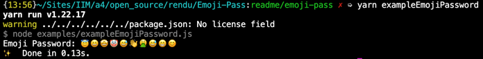

# Emoji-Pass


## Needs
In today's digital age, security is paramount. Password complexity is essential to ensuring the security of online accounts. However, today's commonly used alphanumeric passwords can be difficult to remember.
Why not make them both secure and fun by using emojis?

## Problematic
How can you create memorable passwords while maintaining a high level of security? Emoji-based passwords may be the solution.
## Package

Package name: emoji-password-generator

Description: Emoji-based password generator

link to the package: https://www.npmjs.com/package/emoji-password-generator


## Code

```
📦emoji-pass
 ┣ 📂.github
 ┃ ┗ 📂workflows
 ┃   ┗ 📜main.yml
 ┣ 📂node_modules
 ┣ 📂tests
 ┃ ┗ 📜generator.test.js
 ┣ 📂examples
 ┃ ┗ 📜exampleEmojiPassword.js
 ┃ ┗ 📜exampleHybridPassword.js
 ┣ 📜emoji-list.js
 ┣ 📜index.js
 ┗ 📜package.json
```


## Installation

```
npm i emoji-password-generator
``` 
or

```
yarn add emoji-password-generator
```

## Example of use

After installing the package, to generate an emoji-based password, simply run the command:
```
npm exampleEmojiPassword
npm exampleHybridPassword
``` 
or

```
yarn exampleEmojiPassword
yarn exampleHybridPassword
```

Results of example:




## Documentation 

##### Introduction
“Emoji Password Generator” is a library designed to create memorable passwords from emojis. These passwords, while fun, also offer a different level of complexity than traditional alphanumeric passwords.
##### Project structure

The project is structured around three main files:

1. index.js: This is the core of the library where the password generation logic is implemented.
2. emoji-list.js: Contains a list of emojis that are used to generate passwords.
3. example.js: Provides an example of using the library.

```
function generatePassword(length) 
```
This function is the main entry point to the library. It generates an emoji password based on the length specified by user.

###### Settings

length

Type: number
Description: The number of emojis you want in the generated password. It must be positive.
Example: if in the generator.test.js file
```
const length = 5;
```
Which means the user wants a password consisting of 5 emojis.
Then the generated password will be composed of 5 emojis.

###### Return value

```
return password;
```

Type: string
Description: Returns a password composed of emojis. The length of this string corresponds to the length parameter provided.
###### Error management
If the length parameter is not of type number or if it is less than or equal to zero, the function will throw an exception with the message: "Invalid password length specified".

###### File emoji-list.js
This file contains an array of emojis that are used by the generatePassword function.
```
module.exports = [
    '😀','😃','😄','😁'
    // ... add as many emojis as you want here
];
```
###### Tests
Tests are provided to ensure the library functions properly:

- Checking the length of the generated password: This test ensures that the generated password has the specified length. Note that the length is multiplied by 2 because each emoji is represented by two characters.

- Verification of the composition of the password: This test verifies that the generated password is composed only of emojis.

To run these tests, use an appropriate command like
```
npm test
``` 
or
```
yarn test
```
depending on your configuration.

Result of test: 


###### Use with example.js
The example file, example.js, demonstrates how to use the library. To run this example:

```
npm exampleEmojiPassword
npm exampleHybridPassword
``` 
or

```
yarn exampleEmojiPassword
yarn exampleHybridPassword
```

Running this command will display a generated emoji password in the console.

Results of example:


## Tests

Tests have been written to ensure the validity of the generated passwords. These tests check
- the length of the generated password
- that the password contains only emojis.

To run the tests, run the following command:

```
npm test
``` 
or

```
yarn test
```

Result of test:


## Roadmap

###### Extending the emoji list:
Currently the generator uses a fixed list of emojis. We plan to expand this list to provide more variety in generated passwords.
Configuration options:

###### Introduction of options to customize password generation.
For example, allowing users to mix emojis with alphanumeric characters.

###### User interface:
Developed a simple user interface so users can generate passwords without having to write any code.

###### Improved GitHub Actions workflows
To automate more tasks, like running tests on every pull request.

###### Multilingual support:
Although emojis are universal, we plan to add documentations and interfaces in different languages ​​to make the generator accessible to a wider audience.

## Changelog
**v2.0.0** - 2023-10-19:
- Add password generation with emoji
- Update examples

**v1.1.0** - 2023-10-18:
- Update module file imports

**v1.0.1** - 2023-10-18:
- Fix translation in README

**v1.0.0** - 2023-10-18:
- Add emoji password generator
- Add emoji password test
- Add emoji password example